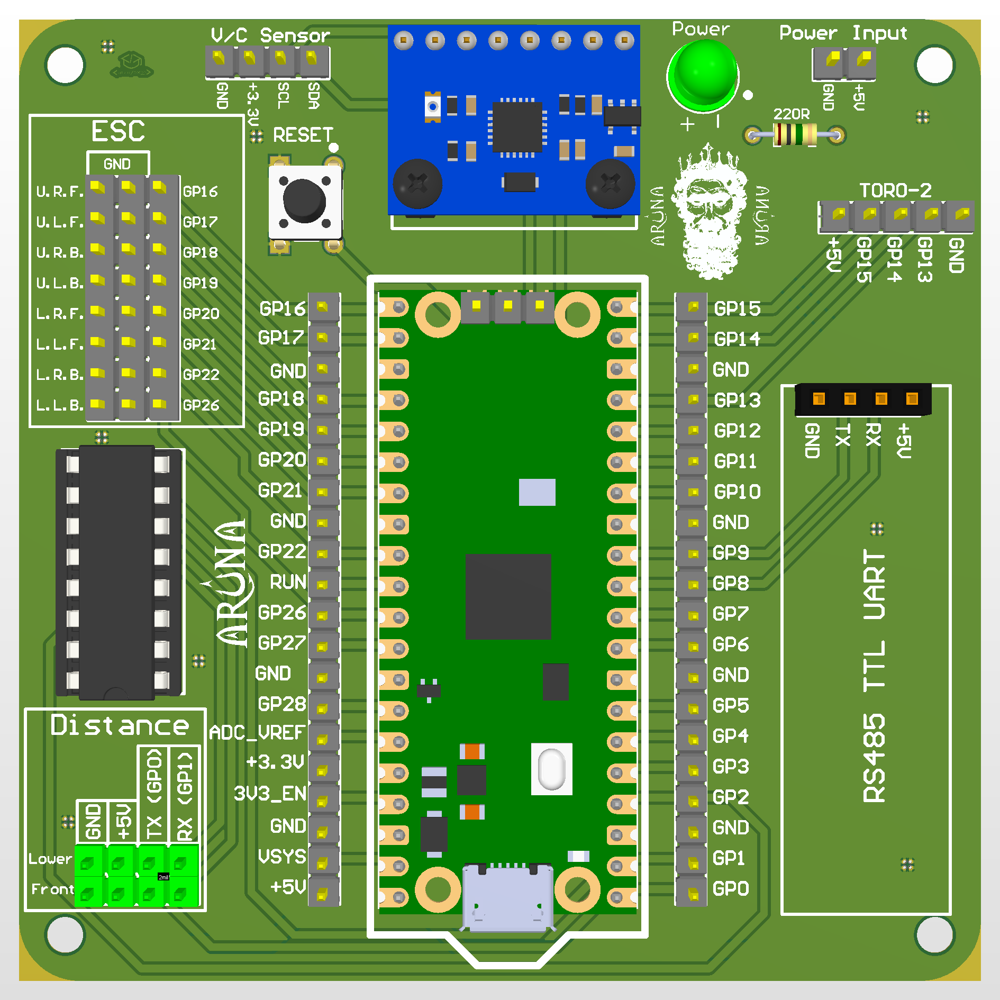

# Aruna-Teknofest-2024-ROV

This is a team named "G-Rov"s auv (autonomous underwater vehicle) remote operating interface. This program runs on Jetson Xavier Nx that the system's computer. This system uses Jetson Xavier Nx because its GPU is better than any other mini computers. So, we can do image processing very fast with using YOLOv10. Also this system uses stm32f103c8t6 blue pill for controling other electronical components like bldc motor, underwater distance sensor, etc. It connects to Jetson Xavier Nx with the ST-Link and USB TTL. We can upload any code for stm32 in the Jetson Xavier Nx with the St-Link. And we can read or write any data from stm32 in the Jetson Xavier Nx with the USB TTL. This stm32 board programmed with Arduino IDE software. Both modules are connected the Jetson Xavier Nx with USB. And this system has a analog camera for we can see the underwater. It connects with usb to the Jetson Xavier Nx too. The stm32 and the camera controls on the Jetson Xavier Nx with the Python software like a server. You can change the interface with the Qt Designer program.

## Arduino IDE Libraries:
**MPU6050_tockn.h:** https://github.com/tockn/MPU6050_tockn<br>
**MadgwickAHRS.h:** https://github.com/arduino-libraries/MadgwickAHRS/<br>
**Base.h:** https://github.com/viyalab/Base100<br>

## Python Libraries:
You can upload the Python libraries with using "requirements.txt" file.<br>
```
cd aruna_codes/aruna_joystick
pip3 install -r requirements.txt
```

## Aruna PCB Card:

**Front:**<br>


**Back:**<br>

