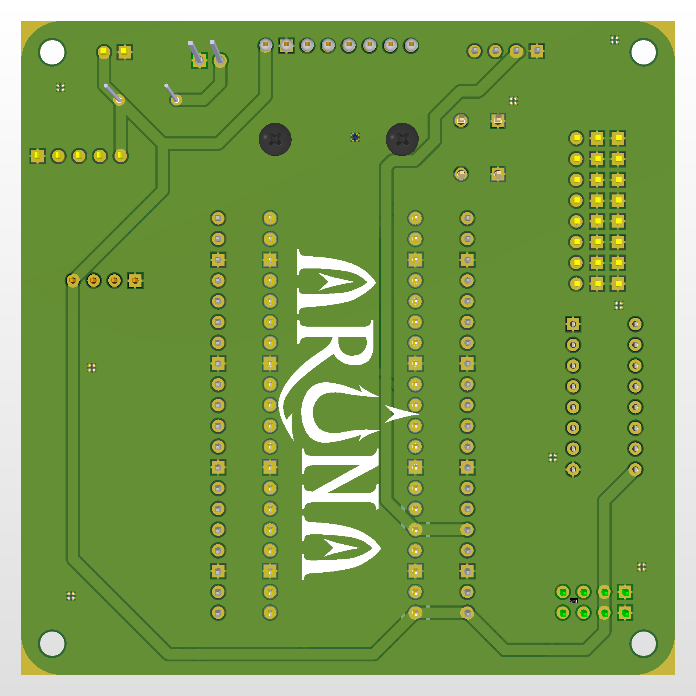

# Aruna-Teknofest-2024-ROV

This is a team named "Aruna" rov (Remote Operating Vehicle) remote control codes. This ROV vehicle's electronic system controls by Raspberry Pi Pico. This module's software was written by Arduino IDE software. This rov vehicles connects the land with cable. It sends camera view to the land and we can control electronical components from the land with RS485. It has as box which is communicate the land and the underwater. This box connects the PC with USB. It has a Python software for controlling the rov vehicle from the PC.

## Arduino IDE Libraries:
**MPU6050_tockn.h:** https://github.com/tockn/MPU6050_tockn<br>
**MadgwickAHRS.h:** https://github.com/arduino-libraries/MadgwickAHRS/<br>
**Base.h:** https://github.com/viyalab/Base100<br>

## Python Libraries:
You can upload the Python libraries to your computer with using "requirements.txt" file.<br>
```
cd aruna_codes/aruna_joystick
pip3 install -r requirements.txt
```

## Aruna PCB Card:

**Front:**<br>


**Back:**<br>

